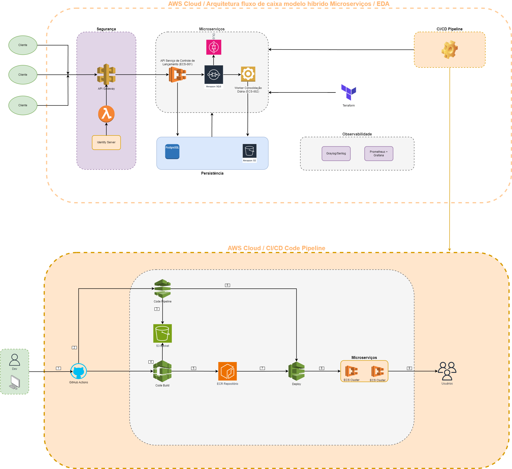

# Fluxograma da Arquitetura

<pre>
Proposta Arquitetural:
	A arquitetura adotada segue um modelo híbrido entre Microsserviços e Event-Driven Architecture (EDA).
	
	Os microsserviços garantem modularidade e escalabilidade, enquanto a abordagem EDA permite comunicação 
	assíncrona eficiente e resiliente.
	
	A comunicação entre os serviços é realizada via AWS SQS, garantindo desacoplamento e tolerância a falhas.
	
	Implementação de Dead Letter Queue (DLQ) para reprocessamento de mensagens que falharem repetidamente.
	
	Estratégia de Retry com Backoff Exponencial para tentativas automáticas de reprocessamento antes de mover
	 mensagens para a DLQ.
	
	O AWS ECS foi escolhido como orquestrador de contêineres devido à sua flexibilidade e melhor suporte 
	para distribuição horizontal e isolamento dos serviços.

Entrada de Requisições
	O cliente interage com a aplicação via AWS API Gateway.
	
	O API Gateway encaminha a requisição para os microsserviços correspondentes.

Autenticação e Autorização
	O Identity Server + JWT é utilizado para autenticação.
	
	O API Gateway valida os tokens antes de encaminhar as requisições.

Microsserviços
	Serviço de Controle de Lançamentos (API)
		Escreve os dados no banco de dados PostgreSQL.
		
		Publica eventos no AWS SQS para processar a consolidação diária.
		
	Serviço de Consolidação Diária (Worker)
		Consome eventos do SQS.
		
		Processa e atualiza o saldo consolidado no banco.
		
		Em caso de falha no processamento, reenvia a mensagem conforme a estratégia de Retry.
		
		Se a mensagem exceder o limite de tentativas, ela é enviada para a DLQ para análise posterior.

		TODO: Futuramente seria interessante armazenar as menssagens que não foram possiveis processar em uma tabela no RDS -> Obs: Este item seria uma melhoria (não contemplado).

Persistência
	PostgreSQL para armazenar os dados transacionais.

	S3 para armazenar os dados consolidados, tendo em mente que pode ser distribuido de uma meneira simples.
	
	TODO: Redis para caching de informações frequentemente acessadas: -> item de melhoria (não contemplado).

Mensageria
	AWS SQS para comunicação assíncrona entre os serviços.
	
	Dead Letter Queue (DLQ) para tratamento de mensagens que não puderam ser processadas.
	
	Retry com Backoff Exponencial para garantir reprocessamento eficiente e evitar sobrecarga.
	
	Garante resiliência e desacoplamento dos microsserviços.

Observabilidade
	Graylog para centralização de logs e monitoramento.
	
	Prometheus + Grafana para métricas adicionais.

CI/CD (Entrega Contínua) (Não contempla na entrega mas está arquitetado)
	GitHub Actions dispara o pipeline ao abrir PRs.
	
	AWS CodeBuild gera as imagens Docker e armazena no AWS ECR.
	
	AWS CodeDeploy faz o deploy no EKS (Kubernetes).
	
	Terraform provisiona toda a infraestrutura na AWS.

Execução em Contêineres
	Os contêineres são gerenciados pelo AWS ECS para escalabilidade automática, distribuição 
	horizontal eficiente e isolamento.

Próximos Passos
	Criar o diagrama visual no draw.io com esses componentes ☑. 
	
	Refinar detalhes sobre autoescalabilidade e failover ☑.
	
	Definir estratégias de segurança para comunicação entre os serviços ☑.
	
	Configurar o monitoramento das mensagens na DLQ para análise e reprocessamento manual quando necessário ☑.
</pre>

  <a href="./0000-desafio.md">Voltar: Especificação Desafio</a>
  <a href="./0002-modelagem-banco-de-dados.md">Próximo: Modelagem de banco de dados</a>

