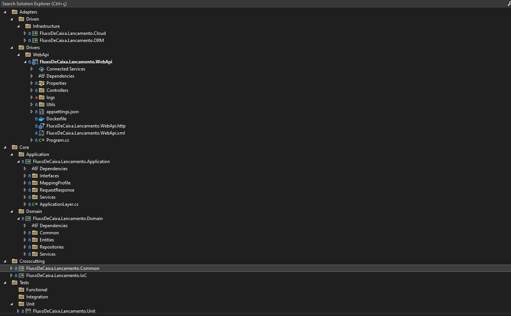
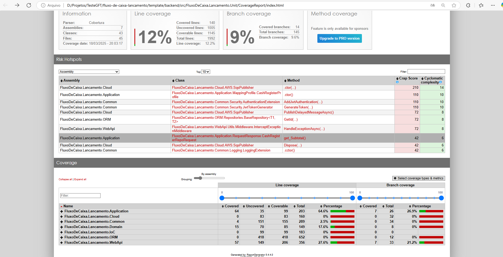
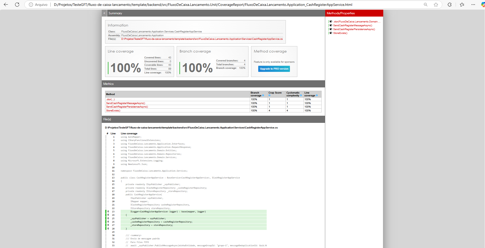
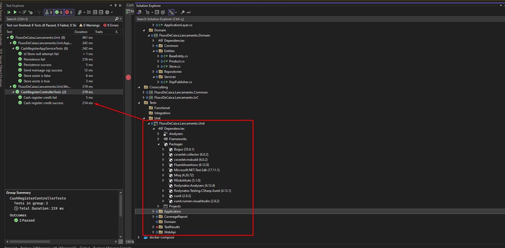

# UM ECS será responsável pela distribuição horizontal do serviço.

### Especificações do projeto
<pre>
Nosso microserviço de lançamento (débito e crédito) para caixa registradora foi 
construido em cima de um template rebusto e a intenção é mostrar uma porção dos
conhecimentos técnicos.

Veremos abaixo o que foi utilizado.
* .Net 8 com C#, API Rest Full, 
	Postgress				-> Para persitência
	Migration				-> Para manipulação das entidades mapedas
	EF						-> ORM de persistência 
	AutoMapper				-> Para o suporte de transacionar informações entres as camadas 
	AWS SQS					-> Para receber o a mensagem que irá trigar o nosso consumer de consolidação de saldo
	CSharpFunctions			-> Para suporte de retorno das operações entre as camadas (Sucesso, Falha, Binds entre outros) 
	Swagger					-> Para documentação aberta dos nossos endpoints.
	Middles					-> Authorization, Authentication, Exception
	Fluent Validation		-> Adicionado com a intenção de validar entrada e saídas de dados (Instrumentado) 
	Serilog					-> Para dossa observabilidade
* TDD
	Adicionado uma pequeno exemplar de cobetura de codigo gerando o dash para melhor visualização de cobertura.
* DDD
	Seguindo o conceitos do DDD (Domain-Driven Design, ou Design Orientado a Domínio) mesclado com SOLID, onde 
	tentei da melhor maneira desacoplar os compo_
	nentes e suas camadas mesmo utilizando um template robusto para a tarefa.

	Acredito que fiz toda cobertura necessária
	S -> Single Responsibility Principle (Princípio da Responsabilidade Única) as camadas e os serviços assumem este 
	comportamento

	O -> Open/Closed Principle (Princípio Aberto/Fechado) com a utilização de heranças, interfaces para estender o 
	comportamento.

	L -> Liskov Substitution Principle (Princípio da Substituição de Liskov) este princípio está implementado 
	principalmente na camada da ORM, nossa classe base das repositories, onde é criado hierarqui de classe, 
	respeitando o comportamento.

	I -> Interface Segregation Principle (Princípio da Segregação de Interfaces) o projeto todo foi desenvolvido 
	pensando na separação de responsabilidade isso leva a uma situação que precisamos ter interfaces distintas.

	D -> Dependency Inversion Principle (Princípio da Inversão de Dependência) A injeção de dependencia ajuda
	seguir este princípio, pois nenhuma service depende de uma repository.
</pre>

### Estrutura de pasta do projeto

## Cobertura de código

Você pode visualizar o relatório de cobertura [aqui](https://github.com/romymoura/fluxo-de-caixa-lancamento/tree/main/template/backend/src/FluxoDeCaixa.Lancamento.Unit/CoverageReport)

## Lib's utilizadas

## Atenção: infra estrutura

O serviço foi arquitetado para rodar na nuvem, a infra estrutura escrita em terraform você encontra [aqui](https://github.com/romymoura/fluxo-de-caixa-infra)

  <a href="./0002-modelagem-banco-de-dados.md">Voltar: Modelagem de banco de dados</a>
  <a href="./0004-faça-você-mesmo-o-setup.md">Próximo: Setup do projeto</a>

