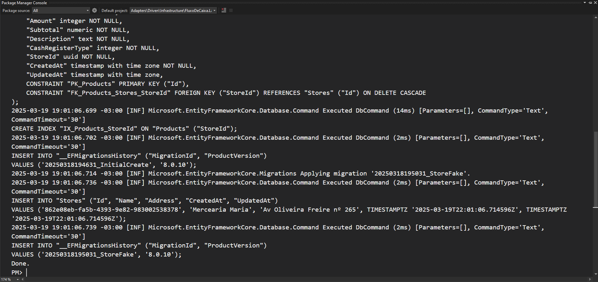

# Setup

# Instale as ferramentas necessárias para rodar localmente os projetos.
	
Clique <a href="https://github.com/romymoura/fluxo-de-caixa-infra/blob/main/README.md">https://github.com/romymoura/fluxo-de-caixa-infra/blob/main/README.md</a>

# Depois de instalados siga os passos.

	* Valide seu docker for windows 

	* Baixar infra com gihub e abra no vs code
	* Navegar até a pasta 

	* Faça os seguintes comando
		* terraform init
		* terraform apply -auto-approve

		
	* Com a AWS CLI e Localstack instalados, abra o bash e faça os seguintes comando
		
		* alias awslocal="aws --endpoint-url=http://localhost:4566" -> (facilita a vida)
		* awslocal s3 ls -> Para verificar se o terraform criou a infra local.
		* awslocal s3api list-objects --bucket consolidado-fluxo-caixa -> Para listar objetos do bucket
		* https://consolidado-fluxo-caixa.s3.localhost.localstack.cloud:4566/862e08eb-fa5b-4393-9e82-983002538378/balance.json -> Para validar conteúdo do arquivo

		Obs: Agora que temos nossa infra e as peças provisionadas, devemos configurar o serviço de lançamento

## Configurando Serviço de Lançamento.
	
	Obs: Serviço desenvolvido em .NET 8

	* Baixar projeto via git clone, fazer restore das dependências e compilar, na pasta de sua preferência 
	abra o bash e cole o comando abaixo.
		git clone https://github.com/romymoura/fluxo-de-caixa-lancamento.git

		Obs: O projeto deve estar buildando.

	* Criar uma base de dados Postgress localmente como o nome de cashregister

	* Abra o VS2022 e siga as instruções das imagens seguintes.

Tecle Enter

Valide se foram criado as tabelas com uma loja inicialmente cadastradas para os testes.	

	
	* Pode rodar o serviço de lançamento pelo VS2022 e deixe ele de pé!

## Conficuragdo o serviço de consolidação

	Obs: Serviço desenvolvido em .NET 8

	* Baixar projeto via git clone, fazer restore das dependências e compilar, na pasta de sua preferência 
	abra o bash e cole o comando abaixo.
		git clone https://github.com/romymoura/fluxo-de-caixa-consolidacao.git

		Obs: O projeto deve estar buildando.

	* Pode rodar o projeto pelo VS2022 e deixar o serviço de pé.

## Postando lançamento
	
	* Com swagger envie o seguinte payload crédito e valide as informações processadas conforme as imagens.
	{
		"cashRegisterType": 1,	// tipo de lançamento
		"price": 10.50,		// Valor lançamento
		"amount": 2		// quantidade de produtos
	}

Para validar o caixa: https://consolidado-fluxo-caixa.s3.localhost.localstack.cloud:4566/862e08eb-fa5b-4393-9e82-983002538378/balance.json

	* Fazendo uma chamda de débito, tirando R$ 1,00.
	{
		"cashRegisterType": 2,
		"price": 1
	}

Reparem que o valor foi reduzido do caixa.

# Considerações

	Pensando em uma funcionalidade de caixa registradora, ainda preciso implementar o 
	endpoint de relatórios. No entanto, priorizei melhorias na consolidação de 
	dados, que na verdade, é um serviço responsável por calcular quanto entra ou sai 
	do nosso caixa.

	Ambos os serviços foram elaborados com o objetivo de serem distribuídos horizontalmente. 
	Em relação aos requisitos não funcionais, acredito que não seriam necessários, pois a 
	arquitetura foi projetada visando alta disponibilidade e resiliência. Para isso, implementamos 
	uma DLQ (Dead Letter Queue) para garantir a contenção de falhas. 
	Além disso, adotamos um raciocínio híbrido, combinando microserviços isolados com um 
	modelo EDA (Event-Driven Architecture) para modular diretamente na nuvem, aproveitando 
	ao máximo os recursos disponíveis.

	Minha arquitetura foi pensada para evitar perda de informações em lançamentos. Para isso, 
	implementamos soluções robustas de observabilidade.
	No entanto, tenho ciência de que há vários aspectos que podem ser melhorados, como:

		* Criar tabelas para mensagens enviadas que não foram processadas;

		* Implementar processamento em lote;

		* Utilizar bulk insert para otimizar inserções no banco de dados;

		* Adotar micro ORMs para simplificar o acesso a dados;

		* Implementar gitflow

		* Implementar CI/CD, porém foi arquitetado

		* Componentizar e desacoplar partes do projeto, entre outras melhorias.

	Espero que gostem do trabalho realizado. Dediquei-me bastante e agradeço pela 
	oportunidade de participar deste teste.	

Clique <a href="https://github.com/romymoura/fluxo-de-caixa-infra/blob/main/README.md">aqui</a> para visitar meu perfil no LinkedIn, obrigado!
	

  <a href="./0003-especificações-do-projeto.md">Voltar: Especificação do projeto</a>
  <a href="./0000-desafio.md">Ir para: Desafio</a>
  <a href="../README.md">Ir Para: Read Me</a>

